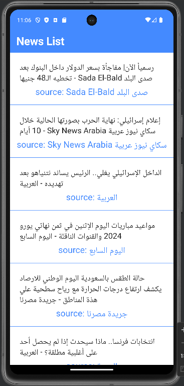

# News Mobile Application

## Overview
News App is an application that present list of news with its sources, and give user the ability to watch full article of this news from the data source by easily clicking it
## Technologies
- 1- http package to get data from api.
- 2- url_launcher to open the full article in the browser.

## Features

### 1. Watch the list of all news

-
### 2. read the full article of a certain title 
 

